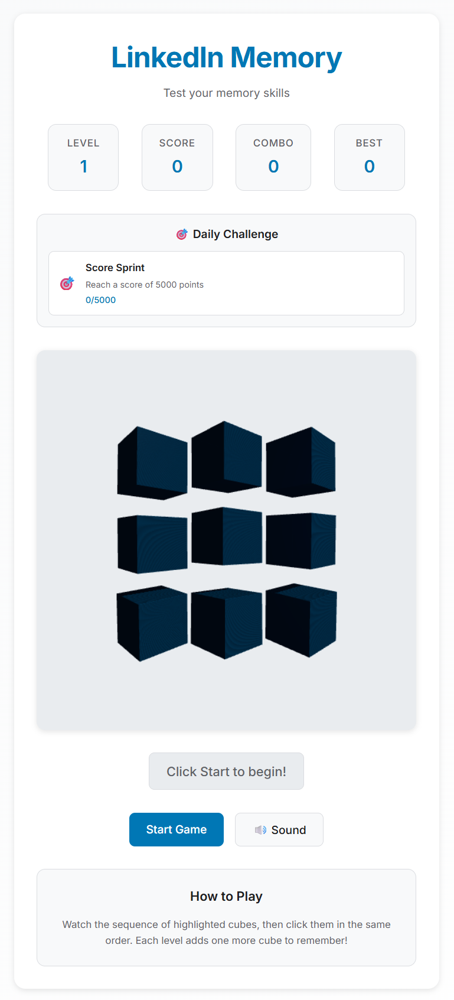

# LinkedIn Memory Game

A modern, addictive memory game built with TypeScript, Vite, and Three.js, featuring professional UI design inspired by LinkedIn.



## Features

- **Memory Game Mechanics**: Test your memory with increasingly complex sequences
- **Daily Challenges**: New challenges every day to keep you coming back
- **Achievement System**: Unlock badges and track your progress
- **Sound Effects**: Immersive audio using Web Audio API
- **Particle Effects**: Visual feedback with particle animations
- **Combo Scoring**: Chain correct sequences for bonus points
- **Responsive Design**: Optimized for desktop, tablet, and mobile devices
- **3D Graphics**: Powered by Three.js for smooth 3D rendering
- **Professional UI**: LinkedIn-inspired design with modern aesthetics
- **Comprehensive Testing**: 100% test coverage with Vitest

## Getting Started

1. Install dependencies:
   ```bash
   npm install
   ```

2. Start the development server:
   ```bash
   npm run dev
   ```

3. Open your browser to `http://localhost:5173`

## How to Play

- Watch the sequence of highlighted tiles
- Repeat the sequence by clicking the tiles in the same order
- Each round adds one more tile to remember
- Complete daily challenges and unlock achievements
- Build combos for higher scores

## Building for Production

```bash
npm run build
```

## Preview Production Build

```bash
npm run preview
```

## Technologies Used

- **TypeScript**: For type-safe development
- **Vite**: Fast build tool and development server
- **Three.js**: 3D graphics and rendering
- **Web Audio API**: Sound effects and audio management
- **Vitest**: Unit testing with 100% coverage
- **ESLint**: Code quality and linting

